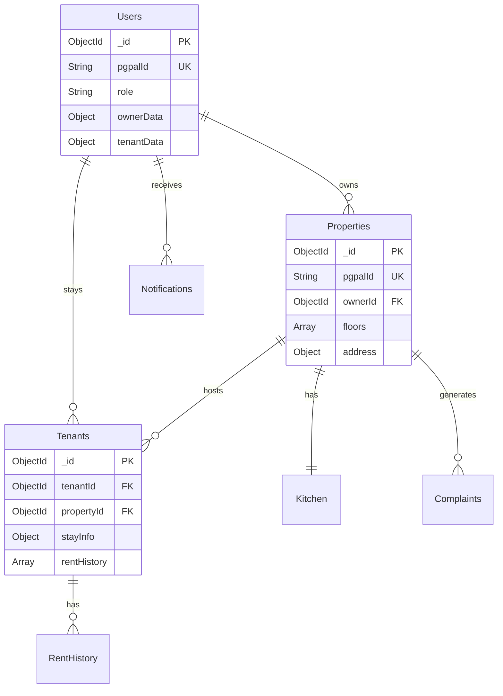

# 🏗️ PgPaal - Comprehensive System Design Documentation

## Table of Contents

1. [System Architecture Overview](#system-architecture-overview)
2. [Database Design & Schema](#database-design--schema)
3. [API Documentation](#api-documentation)
4. [Security Architecture](#security-architecture)
5. [Deployment & Infrastructure](#deployment--infrastructure)
6. [Scalability & Performance](#scalability--performance)
7. [Monitoring & Observability](#monitoring--observability)

---

## System Architecture Overview

### High-Level Architecture

```
┌─────────────────────────────────────────────────────────────────┐
│                         CLIENT LAYER                            │
├─────────────────────────────────────────────────────────────────┤
│  React Web App (TypeScript)    │    Mobile Apps (Future)        │
│  ├─ Owner Dashboard            │    ├─ iOS App                   │
│  ├─ Tenant Portal              │    ├─ Android App              │
│  └─ Admin Panel                │    └─ Progressive Web App      │
└─────────────────────────────────────────────────────────────────┘
                              │
                         API Gateway
                              │
┌─────────────────────────────────────────────────────────────────┐
│                    MICROSERVICES LAYER                          │
├─────────────────────────────────────────────────────────────────┤
│  Auth Service    │  Property Service   │  Tenant Service        │
│  ├─ JWT Auth     │  ├─ CRUD Operations │  ├─ Lifecycle Mgmt     │
│  ├─ OTP Verify   │  ├─ Media Upload    │  ├─ Stay Management    │
│  └─ Refresh      │  └─ Search/Filter   │  └─ Rent Tracking      │
├─────────────────────────────────────────────────────────────────┤
│  Kitchen Service │  Complaint Service  │  Notification Service  │
│  ├─ Menu Mgmt    │  ├─ Ticket System   │  ├─ Real-time Push     │
│  ├─ Attendance   │  ├─ Priority Queue  │  ├─ Email/SMS          │
│  └─ Billing      │  └─ Resolution      │  └─ In-app Alerts      │
├─────────────────────────────────────────────────────────────────┤
│  Dashboard Service │ Rent Service      │  File Service          │
│  ├─ Analytics      │ ├─ Payment Track   │  ├─ Image Upload       │
│  ├─ Reports        │ ├─ Receipt Gen     │  ├─ Document Storage   │
│  └─ Metrics        │ └─ Defaulters     │  └─ CDN Integration    │
└─────────────────────────────────────────────────────────────────┘
                              │
┌─────────────────────────────────────────────────────────────────┐
│                       DATA LAYER                                │
├─────────────────────────────────────────────────────────────────┤
│  MongoDB Atlas    │  Redis Cache       │  File Storage (S3)     │
│  ├─ User Data     │  ├─ Sessions       │  ├─ Property Images    │
│  ├─ Properties    │  ├─ Search Cache   │  ├─ Documents          │
│  ├─ Bookings      │  └─ Rate Limiting  │  └─ User Avatars       │
│  └─ Analytics     │                    │                        │
└─────────────────────────────────────────────────────────────────┘
```

### Component Interaction Flow

```
┌─────────────┐    HTTP/HTTPS     ┌─────────────┐
│   Client    │ ◄───────────────► │  API Gateway │
│  (React)    │   REST/GraphQL    │  (Express)   │
└─────────────┘                   └─────────────┘
                                        │
                                   Load Balancer
                                        │
                              ┌─────────┼─────────┐
                              │         │         │
                    ┌─────────▼───┐ ┌───▼───┐ ┌───▼───────┐
                    │ Auth Service│ │ Property│ │  Tenant   │
                    │   :3001     │ │ Service │ │  Service  │
                    └─────────────┘ │  :3002  │ │   :3003   │
                                    └─────────┘ └───────────┘
                              ┌─────────┼─────────┐
                              │         │         │
                    ┌─────────▼───┐ ┌───▼───┐ ┌───▼───────┐
                    │ Kitchen     │ │Complaint│ │Notification│
                    │ Service     │ │ Service │ │  Service   │
                    │   :3004     │ │  :3005  │ │   :3006    │
                    └─────────────┘ └─────────┘ └────────────┘
```

---

## Database Design & Schema

### MongoDB Collections Structure

#### 1. Users Collection

```javascript
{
  _id: ObjectId,
  pgpalId: String,        // Unique identifier (PPID)
  username: String,       // Unique username
  email: String,          // Unique email
  phoneNumber: String,    // Unique phone number
  name: String,
  role: String,           // "owner", "tenant", "admin"
  password: String,       // Hashed password
  gender: String,
  currentPlan: String,    // "trial", "starter", "professional"
  isTrialClaimed: Boolean,
  profileImage: String,
  isVerified: Boolean,
  lastLogin: Date,
  createdAt: Date,
  updatedAt: Date,

  // Role-specific fields
  ownerData: {
    properties: [ObjectId],
    subscriptionHistory: [],
    billingInfo: Object
  },

  tenantData: {
    currentStay: ObjectId,
    stayHistory: [ObjectId],
    preferences: Object
  }
}
```

#### 2. Properties Collection

```javascript
{
  _id: ObjectId,
  pgpalId: String,        // Property unique ID
  ownerId: ObjectId,      // Reference to Users collection
  name: String,
  description: String,

  address: {
    line1: String,
    line2: String,
    street: String,
    area: String,
    city: String,
    state: String,
    pincode: String,
    plotNumber: String,
    coordinates: {
      lat: Number,
      lng: Number
    }
  },

  floors: [
    {
      floorNumber: Number,
      rooms: [
        {
          roomNumber: String,
          type: String,      // "single", "double", "triple"
          rentPerBed: Number,
          beds: [
            {
              bedId: String,
              status: String, // "available", "occupied", "maintenance"
              tenant: ObjectId
            }
          ]
        }
      ]
    }
  ],

  amenities: [String],
  images: [String],
  policies: {
    gateTimings: Object,
    visitorPolicy: String,
    smokingPolicy: String,
    alcoholPolicy: String
  },

  contactInfo: {
    phone: String,
    alternatePhone: String,
    email: String
  },

  isActive: Boolean,
  isVerified: Boolean,
  rating: Number,
  reviewCount: Number,
  totalBeds: Number,
  occupiedBeds: Number,

  createdAt: Date,
  updatedAt: Date
}
```

#### 3. Tenants/Stays Collection

```javascript
{
  _id: ObjectId,
  tenantId: ObjectId,     // Reference to Users collection
  propertyId: ObjectId,   // Reference to Properties collection
  propertyPpid: String,

  bedDetails: {
    floorNumber: Number,
    roomNumber: String,
    bedId: String
  },

  stayInfo: {
    checkInDate: Date,
    checkOutDate: Date,    // null for current stays
    rentAmount: Number,
    securityDeposit: Number,
    agreementDuration: Number, // months
    status: String         // "active", "vacated", "notice_period"
  },

  rentHistory: [
    {
      month: String,
      year: Number,
      amount: Number,
      paidDate: Date,
      paymentMethod: String,
      receiptNumber: String,
      status: String        // "paid", "pending", "overdue"
    }
  ],

  emergencyContact: {
    name: String,
    phone: String,
    relation: String
  },

  documents: [
    {
      type: String,         // "aadhar", "pan", "photo", "agreement"
      url: String,
      uploadDate: Date
    }
  ],

  createdAt: Date,
  updatedAt: Date
}
```

#### 4. Kitchen/Menus Collection

```javascript
{
  _id: ObjectId,
  propertyPpid: String,
  menuNo: Number,

  meals: {
    breakfast: {
      items: [String],
      timing: String,
      price: Number
    },
    lunch: {
      items: [String],
      timing: String,
      price: Number
    },
    dinner: {
      items: [String],
      timing: String,
      price: Number
    }
  },

  isSelected: Boolean,    // Only one menu can be selected per property
  isActive: Boolean,

  attendance: [
    {
      date: Date,
      meal: String,       // "breakfast", "lunch", "dinner"
      tenants: [
        {
          tenantPpid: String,
          confirmed: Boolean,
          timestamp: Date
        }
      ]
    }
  ],

  createdAt: Date,
  updatedAt: Date
}
```

#### 5. Complaints Collection

```javascript
{
  _id: ObjectId,
  complaintId: String,    // Unique complaint ID
  propertyId: ObjectId,
  propertyPpid: String,

  raiserInfo: {
    type: String,         // "tenant", "owner"
    id: ObjectId,
    name: String,
    contact: String
  },

  complaint: {
    category: String,     // "maintenance", "food", "facilities", "other"
    title: String,
    description: String,
    priority: String,     // "low", "medium", "high", "urgent"
    images: [String]
  },

  resolution: {
    status: String,       // "open", "in_progress", "resolved", "closed"
    assignedTo: ObjectId,
    resolvedBy: ObjectId,
    resolutionNote: String,
    resolutionDate: Date
  },

  timeline: [
    {
      action: String,
      performedBy: ObjectId,
      timestamp: Date,
      note: String
    }
  ],

  createdAt: Date,
  updatedAt: Date
}
```

#### 6. Notifications Collection

```javascript
{
  _id: ObjectId,
  notificationId: String,

  recipient: {
    userId: ObjectId,
    userPpid: String,
    role: String
  },

  content: {
    title: String,
    message: String,
    type: String,         // "rent_due", "complaint", "kitchen", "system"
    category: String,
    metadata: Object      // Additional context data
  },

  delivery: {
    channels: [String],   // "in_app", "email", "sms", "push"
    isRead: Boolean,
    readAt: Date,
    deliveredAt: Date
  },

  automation: {
    isAutomated: Boolean,
    jobName: String,
    triggerEvent: String
  },

  createdAt: Date,
  expireAt: Date         // TTL for cleanup
}
```

### Database Relationships



---

## API Documentation

### Authentication Service (:3001)

#### Base URL: `/api/auth-service`

| Method | Endpoint                      | Description                   | Auth Required |
| ------ | ----------------------------- | ----------------------------- | ------------- |
| POST   | `/register`                   | User registration with OTP    | No            |
| POST   | `/login`                      | User login with credentials   | No            |
| POST   | `/logout`                     | User logout                   | Yes           |
| POST   | `/otp/verify`                 | Verify OTP for registration   | No            |
| POST   | `/refresh-token`              | Refresh authentication token  | Yes           |
| GET    | `/me`                         | Get current user profile      | Yes           |
| POST   | `/forgot-password-request`    | Request password reset OTP    | No            |
| POST   | `/forgot-password-verify-otp` | Verify OTP and reset password | No            |
| GET    | `/check-usernames`            | Check username availability   | No            |
| GET    | `/check-email`                | Check email availability      | No            |
| GET    | `/check-phonenumber`          | Check phone availability      | No            |

### Property Service (:3002)

#### Base URL: `/api/property-service`

| Method | Endpoint               | Description                  | Auth Required |
| ------ | ---------------------- | ---------------------------- | ------------- |
| GET    | `/own`                 | Get owner's properties       | Yes (Owner)   |
| POST   | `/`                    | Create new property          | Yes (Owner)   |
| PUT    | `/:id`                 | Update property details      | Yes (Owner)   |
| GET    | `/property/:id`        | Get property by ID           | Yes           |
| GET    | `/properties/nearby`   | Get nearby properties        | No            |
| GET    | `/search`              | Search properties by filters | No            |
| GET    | `/:id/rules`           | Get property rules           | Yes           |
| POST   | `/:id/images`          | Upload property images       | Yes (Owner)   |
| DELETE | `/:id/images/:imageId` | Delete property image        | Yes (Owner)   |

### Tenant Service (:3003)

#### Base URL: `/api/tenant-service`

| Method | Endpoint               | Description               | Auth Required |
| ------ | ---------------------- | ------------------------- | ------------- |
| GET    | `/myStay`              | Get current tenant stay   | Yes (Tenant)  |
| GET    | `/tenants`             | Get tenants by property   | Yes (Owner)   |
| POST   | `/`                    | Add new tenant            | Yes (Owner)   |
| POST   | `/remove-tenant/:id`   | Remove tenant             | Yes (Owner)   |
| POST   | `/retain-tenant/:id`   | Retain tenant             | Yes (Owner)   |
| GET    | `/vacateHistory/:ppid` | Get vacate history        | Yes (Owner)   |
| POST   | `/rent/update`         | Update rent payment       | Yes (Owner)   |
| GET    | `/rent/:id/status`     | Get rent status           | Yes           |
| GET    | `/tenant-history`      | Get tenant's stay history | Yes (Tenant)  |

### Kitchen Service (:3004)

#### Base URL: `/api/kitchen-service`

| Method | Endpoint                   | Description                    | Auth Required |
| ------ | -------------------------- | ------------------------------ | ------------- |
| GET    | `/:pppId`                  | Get all menus for property     | Yes (Owner)   |
| POST   | `/menu`                    | Add new menu                   | Yes (Owner)   |
| PUT    | `/update`                  | Update menu                    | Yes (Owner)   |
| DELETE | `/delete`                  | Delete menu                    | Yes (Owner)   |
| PUT    | `/select-menu`             | Select active menu             | Yes (Owner)   |
| GET    | `/kitchens/:id/menu/today` | Get today's selected menu      | Yes           |
| POST   | `/attendance`              | Mark meal attendance           | Yes           |
| GET    | `/attendance`              | Get attendance data            | Yes (Owner)   |
| PUT    | `/jobs/status`             | Toggle notification automation | Yes (Owner)   |

### Complaint Service (:3005)

#### Base URL: `/api/complaint-service`

| Method | Endpoint                       | Description              | Auth Required |
| ------ | ------------------------------ | ------------------------ | ------------- |
| GET    | `/`                            | Get all complaints       | Yes           |
| POST   | `/`                            | Raise new complaint      | Yes           |
| GET    | `/:id`                         | Get complaint by ID      | Yes           |
| PUT    | `/:id`                         | Update complaint         | Yes           |
| DELETE | `/:id`                         | Delete complaint         | Yes           |
| GET    | `/metrics/summary/:propertyId` | Get complaint metrics    | Yes (Owner)   |
| PUT    | `/:id/status`                  | Update complaint status  | Yes           |
| POST   | `/:id/comments`                | Add comment to complaint | Yes           |

### Notification Service (:3006)

#### Base URL: `/api/notification-service`

| Method | Endpoint      | Description              | Auth Required |
| ------ | ------------- | ------------------------ | ------------- |
| GET    | `/`           | Get notifications        | Yes           |
| POST   | `/`           | Send notification        | Yes           |
| PUT    | `/:id/read`   | Mark as read             | Yes           |
| PUT    | `/read-all`   | Mark all as read         | Yes           |
| DELETE | `/:id`        | Delete notification      | Yes           |
| DELETE | `/delete-all` | Delete all notifications | Yes           |
| POST   | `/broadcast`  | Broadcast notification   | Yes (Admin)   |

### Dashboard Service (:3007)

#### Base URL: `/api/dashboard-service`

| Method | Endpoint              | Description            | Auth Required |
| ------ | --------------------- | ---------------------- | ------------- |
| GET    | `/overview/:pgpalId`  | Get dashboard overview | Yes (Owner)   |
| GET    | `/checkins/:pgpalId`  | Get check-in analytics | Yes (Owner)   |
| GET    | `/vacates/:pgpalId`   | Get vacate analytics   | Yes (Owner)   |
| GET    | `/revenue/:pgpalId`   | Get revenue analytics  | Yes (Owner)   |
| GET    | `/occupancy/:pgpalId` | Get occupancy trends   | Yes (Owner)   |

---

## Security Architecture

### Authentication & Authorization

#### JWT Token Strategy

```
┌─────────────────────────────────────────────────────────────────┐
│                    JWT AUTHENTICATION FLOW                      │
├─────────────────────────────────────────────────────────────────┤
│  1. User Login → Auth Service validates credentials              │
│  2. Generate JWT (15min) + Refresh Token (7 days)              │
│  3. Store tokens in HTTP-only cookies                          │
│  4. Client sends JWT in Authorization header                   │
│  5. API Gateway validates JWT for each request                 │
│  6. Auto-refresh token when JWT expires                        │
└─────────────────────────────────────────────────────────────────┘
```

#### Token Structure

```javascript
// JWT Payload
{
  _id: "user_object_id",
  pgpalId: "unique_user_id",
  role: "owner|tenant|admin",
  email: "user@example.com",
  iat: 1234567890,
  exp: 1234567890
}

// Refresh Token (Stored in Redis)
{
  userId: "user_object_id",
  token: "secure_random_string",
  expiresAt: Date,
  deviceInfo: Object
}
```

#### Role-Based Access Control (RBAC)

```typescript
// Permission Matrix
const PERMISSIONS = {
  PROPERTY: {
    CREATE: ["owner"],
    READ: ["owner", "tenant", "admin"],
    UPDATE: ["owner"],
    DELETE: ["owner", "admin"],
  },
  TENANT: {
    CREATE: ["owner"],
    READ: ["owner", "tenant"],
    UPDATE: ["owner"],
    DELETE: ["owner"],
  },
  COMPLAINT: {
    CREATE: ["owner", "tenant"],
    READ: ["owner", "tenant"],
    UPDATE: ["owner"],
    DELETE: ["owner", "admin"],
  },
  ANALYTICS: {
    READ: ["owner", "admin"],
  },
};
```

### Data Security

#### Encryption Standards

- **In Transit**: TLS 1.3 for all API communications
- **At Rest**: AES-256 encryption for sensitive data
- **Passwords**: bcrypt with salt rounds = 12
- **PII Data**: Field-level encryption for sensitive information

#### Input Validation & Sanitization

```typescript
// Request validation middleware
const validateRequest = (schema: Joi.Schema) => {
  return (req: Request, res: Response, next: NextFunction) => {
    const { error } = schema.validate(req.body);
    if (error) {
      return res.status(400).json({
        success: false,
        message: "Validation error",
        errors: error.details,
      });
    }
    next();
  };
};
```

#### Rate Limiting & DDoS Protection

```typescript
// Rate limiting configuration
const rateLimiter = rateLimit({
  windowMs: 15 * 60 * 1000, // 15 minutes
  max: 100, // Limit each IP to 100 requests per windowMs
  message: "Too many requests from this IP",
  standardHeaders: true,
  legacyHeaders: false,
});

// API-specific limits
const authLimiter = rateLimit({
  windowMs: 15 * 60 * 1000,
  max: 5, // 5 login attempts per 15 minutes
  skipSuccessfulRequests: true,
});
```

---

## Deployment & Infrastructure

### Container Architecture

#### Docker Composition

```yaml
version: "3.8"
services:
  # Frontend
  web:
    build: ./client
    ports:
      - "3000:3000"
    environment:
      - REACT_APP_API_URL=http://api-gateway:4000
    depends_on:
      - api-gateway

  # API Gateway
  api-gateway:
    build: ./api-gateway
    ports:
      - "4000:4000"
    environment:
      - NODE_ENV=production
      - REDIS_URL=redis://redis:6379
    depends_on:
      - redis
      - auth-service
      - property-service

  # Microservices
  auth-service:
    build: ./services/auth
    ports:
      - "3001:3001"
    environment:
      - MONGODB_URI=mongodb://mongo:27017/pgpaal_auth
      - JWT_SECRET=${JWT_SECRET}
      - REDIS_URL=redis://redis:6379
    depends_on:
      - mongo
      - redis

  property-service:
    build: ./services/property
    ports:
      - "3002:3002"
    environment:
      - MONGODB_URI=mongodb://mongo:27017/pgpaal_properties
    depends_on:
      - mongo

  # Infrastructure
  mongo:
    image: mongo:5.0
    restart: always
    environment:
      MONGO_INITDB_ROOT_USERNAME: ${MONGO_USERNAME}
      MONGO_INITDB_ROOT_PASSWORD: ${MONGO_PASSWORD}
    volumes:
      - mongodb_data:/data/db

  redis:
    image: redis:7-alpine
    restart: always
    command: redis-server --appendonly yes
    volumes:
      - redis_data:/data

volumes:
  mongodb_data:
  redis_data:
```

### Kubernetes Deployment

#### Namespace Configuration

```yaml
apiVersion: v1
kind: Namespace
metadata:
  name: pgpaal-production
---
apiVersion: v1
kind: Namespace
metadata:
  name: pgpaal-staging
```

#### Deployment Configuration

```yaml
apiVersion: apps/v1
kind: Deployment
metadata:
  name: auth-service
  namespace: pgpaal-production
spec:
  replicas: 3
  selector:
    matchLabels:
      app: auth-service
  template:
    metadata:
      labels:
        app: auth-service
    spec:
      containers:
        - name: auth-service
          image: pgpaal/auth-service:latest
          ports:
            - containerPort: 3001
          env:
            - name: MONGODB_URI
              valueFrom:
                secretKeyRef:
                  name: mongodb-secret
                  key: uri
            - name: JWT_SECRET
              valueFrom:
                secretKeyRef:
                  name: jwt-secret
                  key: secret
          resources:
            requests:
              memory: "256Mi"
              cpu: "250m"
            limits:
              memory: "512Mi"
              cpu: "500m"
          livenessProbe:
            httpGet:
              path: /health
              port: 3001
            initialDelaySeconds: 30
            periodSeconds: 10
          readinessProbe:
            httpGet:
              path: /ready
              port: 3001
            initialDelaySeconds: 5
            periodSeconds: 5
```

### CI/CD Pipeline

#### GitHub Actions Workflow

```yaml
name: PgPaal CI/CD Pipeline

on:
  push:
    branches: [main, develop]
  pull_request:
    branches: [main]

jobs:
  test:
    runs-on: ubuntu-latest
    steps:
      - uses: actions/checkout@v3

      - name: Setup Node.js
        uses: actions/setup-node@v3
        with:
          node-version: "18"
          cache: "npm"

      - name: Install dependencies
        run: |
          npm ci
          cd client && npm ci

      - name: Run tests
        run: |
          npm run test:unit
          npm run test:integration
          npm run test:e2e

      - name: Security audit
        run: npm audit --audit-level moderate

  build-and-deploy:
    needs: test
    runs-on: ubuntu-latest
    if: github.ref == 'refs/heads/main'

    steps:
      - uses: actions/checkout@v3

      - name: Configure AWS credentials
        uses: aws-actions/configure-aws-credentials@v2
        with:
          aws-access-key-id: ${{ secrets.AWS_ACCESS_KEY_ID }}
          aws-secret-access-key: ${{ secrets.AWS_SECRET_ACCESS_KEY }}
          aws-region: ap-south-1

      - name: Build and push Docker images
        run: |
          docker build -t pgpaal/auth-service:${{ github.sha }} ./services/auth
          docker build -t pgpaal/property-service:${{ github.sha }} ./services/property

          echo ${{ secrets.DOCKER_PASSWORD }} | docker login -u ${{ secrets.DOCKER_USERNAME }} --password-stdin

          docker push pgpaal/auth-service:${{ github.sha }}
          docker push pgpaal/property-service:${{ github.sha }}

      - name: Deploy to Kubernetes
        run: |
          kubectl set image deployment/auth-service auth-service=pgpaal/auth-service:${{ github.sha }} -n pgpaal-production
          kubectl set image deployment/property-service property-service=pgpaal/property-service:${{ github.sha }} -n pgpaal-production
          kubectl rollout status deployment/auth-service -n pgpaal-production
```

### Environment Configuration

#### Production Environment

```bash
# API Configuration
NODE_ENV=production
PORT=4000
API_VERSION=v1

# Database
MONGODB_URI=mongodb+srv://cluster.mongodb.net/pgpaal_prod
REDIS_URL=redis://elasticache.region.amazonaws.com:6379

# Security
JWT_SECRET=super_secure_jwt_secret_key
JWT_EXPIRES_IN=15m
REFRESH_TOKEN_EXPIRES_IN=7d
BCRYPT_SALT_ROUNDS=12

# External Services
AWS_REGION=ap-south-1
S3_BUCKET=pgpaal-uploads-prod
CLOUDFRONT_DOMAIN=cdn.pgpaal.com

# Monitoring
SENTRY_DSN=https://sentry.io/projects/pgpaal
NEW_RELIC_LICENSE_KEY=newrelic_license_key

# Notifications
EMAIL_SERVICE=sendgrid
SENDGRID_API_KEY=sendgrid_api_key
SMS_SERVICE=twilio
TWILIO_ACCOUNT_SID=twilio_sid
TWILIO_AUTH_TOKEN=twilio_token

# Rate Limiting
RATE_LIMIT_WINDOW_MS=900000
RATE_LIMIT_MAX_REQUESTS=100
RATE_LIMIT_AUTH_MAX=5
```

---

## Scalability & Performance

### Horizontal Scaling Strategy

#### Load Balancing

```nginx
upstream auth_service {
    least_conn;
    server auth-service-1:3001;
    server auth-service-2:3001;
    server auth-service-3:3001;
}

upstream property_service {
    least_conn;
    server property-service-1:3002;
    server property-service-2:3002;
    server property-service-3:3002;
}

server {
    listen 80;
    server_name api.pgpaal.com;

    location /api/auth-service/ {
        proxy_pass http://auth_service;
        proxy_set_header Host $host;
        proxy_set_header X-Real-IP $remote_addr;
        proxy_set_header X-Forwarded-For $proxy_add_x_forwarded_for;
        proxy_set_header X-Forwarded-Proto $scheme;
    }

    location /api/property-service/ {
        proxy_pass http://property_service;
        proxy_set_header Host $host;
        proxy_set_header X-Real-IP $remote_addr;
        proxy_set_header X-Forwarded-For $proxy_add_x_forwarded_for;
        proxy_set_header X-Forwarded-Proto $scheme;
    }
}
```

#### Auto-Scaling Configuration

```yaml
apiVersion: autoscaling/v2
kind: HorizontalPodAutoscaler
metadata:
  name: auth-service-hpa
  namespace: pgpaal-production
spec:
  scaleTargetRef:
    apiVersion: apps/v1
    kind: Deployment
    name: auth-service
  minReplicas: 2
  maxReplicas: 10
  metrics:
    - type: Resource
      resource:
        name: cpu
        target:
          type: Utilization
          averageUtilization: 70
    - type: Resource
      resource:
        name: memory
        target:
          type: Utilization
          averageUtilization: 80
```

### Caching Strategy

#### Multi-Level Caching

```typescript
// Redis Cache Implementation
class CacheService {
  private redis: Redis;

  constructor() {
    this.redis = new Redis(process.env.REDIS_URL);
  }

  async get<T>(key: string): Promise<T | null> {
    const cached = await this.redis.get(key);
    return cached ? JSON.parse(cached) : null;
  }

  async set(key: string, value: any, ttl: number = 3600): Promise<void> {
    await this.redis.setex(key, ttl, JSON.stringify(value));
  }

  async del(key: string): Promise<void> {
    await this.redis.del(key);
  }

  async invalidatePattern(pattern: string): Promise<void> {
    const keys = await this.redis.keys(pattern);
    if (keys.length > 0) {
      await this.redis.del(...keys);
    }
  }
}

// Cache Keys Strategy
const CACHE_KEYS = {
  USER_PROFILE: (userId: string) => `user:profile:${userId}`,
  PROPERTY_DETAILS: (propertyId: string) => `property:${propertyId}`,
  NEARBY_PROPERTIES: (lat: number, lng: number) => `nearby:${lat}:${lng}`,
  SEARCH_RESULTS: (query: string) =>
    `search:${Buffer.from(query).toString("base64")}`,
  DASHBOARD_OVERVIEW: (pgpalId: string) => `dashboard:overview:${pgpalId}`,
};

// Cache TTL Configuration
const CACHE_TTL = {
  USER_PROFILE: 3600, // 1 hour
  PROPERTY_DETAILS: 1800, // 30 minutes
  NEARBY_PROPERTIES: 900, // 15 minutes
  SEARCH_RESULTS: 600, // 10 minutes
  DASHBOARD_OVERVIEW: 300, // 5 minutes
};
```

### Database Optimization

#### MongoDB Indexing Strategy

```javascript
// Users Collection Indexes
db.users.createIndex({ pgpalId: 1 }, { unique: true });
db.users.createIndex({ email: 1 }, { unique: true });
db.users.createIndex({ username: 1 }, { unique: true });
db.users.createIndex({ phoneNumber: 1 }, { unique: true });
db.users.createIndex({ role: 1 });
db.users.createIndex({ lastLogin: -1 });

// Properties Collection Indexes
db.properties.createIndex({ pgpalId: 1 }, { unique: true });
db.properties.createIndex({ ownerId: 1 });
db.properties.createIndex({ "address.coordinates": "2dsphere" }); // Geospatial
db.properties.createIndex({ "address.city": 1, "address.state": 1 });
db.properties.createIndex({ isActive: 1, isVerified: 1 });
db.properties.createIndex({ amenities: 1 });
db.properties.createIndex({ "floors.rooms.beds.status": 1 });

// Tenants Collection Indexes
db.tenants.createIndex({ tenantId: 1 });
db.tenants.createIndex({ propertyId: 1 });
db.tenants.createIndex({ propertyPpid: 1 });
db.tenants.createIndex({ "stayInfo.status": 1 });
db.tenants.createIndex({ "stayInfo.checkInDate": -1 });
db.tenants.createIndex({ "rentHistory.status": 1 });

// Complaints Collection Indexes
db.complaints.createIndex({ complaintId: 1 }, { unique: true });
db.complaints.createIndex({ propertyPpid: 1 });
db.complaints.createIndex({ "resolution.status": 1 });
db.complaints.createIndex({ "complaint.priority": 1 });
db.complaints.createIndex({ createdAt: -1 });

// Notifications Collection Indexes
db.notifications.createIndex({ "recipient.userId": 1 });
db.notifications.createIndex({ "recipient.userPpid": 1 });
db.notifications.createIndex({ "delivery.isRead": 1 });
db.notifications.createIndex({ createdAt: -1 });
db.notifications.createIndex({ expireAt: 1 }, { expireAfterSeconds: 0 }); // TTL
```

---

## Monitoring & Observability

### Application Performance Monitoring

#### Metrics Collection

```typescript
// Prometheus Metrics
import { createPrometheusMetrics } from "prom-client";

const metrics = {
  httpRequestDuration: new promClient.Histogram({
    name: "http_request_duration_ms",
    help: "Duration of HTTP requests in ms",
    labelNames: ["method", "route", "status_code"],
    buckets: [0.1, 5, 15, 50, 100, 500],
  }),

  httpRequestTotal: new promClient.Counter({
    name: "http_requests_total",
    help: "Total number of HTTP requests",
    labelNames: ["method", "route", "status_code"],
  }),

  databaseQueryDuration: new promClient.Histogram({
    name: "database_query_duration_ms",
    help: "Duration of database queries in ms",
    labelNames: ["operation", "collection"],
    buckets: [1, 5, 15, 50, 100, 500],
  }),

  activeUsers: new promClient.Gauge({
    name: "active_users_total",
    help: "Number of active users",
    labelNames: ["role"],
  }),
};
```

#### Health Check Endpoints

```typescript
// Health Check Implementation
app.get("/health", async (req, res) => {
  const health = {
    status: "ok",
    timestamp: new Date().toISOString(),
    uptime: process.uptime(),
    checks: {
      database: await checkDatabase(),
      redis: await checkRedis(),
      externalServices: await checkExternalServices(),
    },
  };

  const allHealthy = Object.values(health.checks).every(
    (check) => check.status === "ok"
  );
  res.status(allHealthy ? 200 : 503).json(health);
});

app.get("/ready", async (req, res) => {
  // Readiness check for Kubernetes
  const ready = await checkApplicationReadiness();
  res.status(ready ? 200 : 503).json({ status: ready ? "ready" : "not ready" });
});
```

### Logging Strategy

#### Structured Logging

```typescript
import winston from "winston";

const logger = winston.createLogger({
  level: process.env.LOG_LEVEL || "info",
  format: winston.format.combine(
    winston.format.timestamp(),
    winston.format.errors({ stack: true }),
    winston.format.json()
  ),
  defaultMeta: {
    service: process.env.SERVICE_NAME || "pgpaal-api",
    version: process.env.SERVICE_VERSION || "1.0.0",
  },
  transports: [
    new winston.transports.File({ filename: "error.log", level: "error" }),
    new winston.transports.File({ filename: "combined.log" }),
    new winston.transports.Console({
      format: winston.format.combine(
        winston.format.colorize(),
        winston.format.simple()
      ),
    }),
  ],
});

// Request logging middleware
const requestLogger = (req: Request, res: Response, next: NextFunction) => {
  const start = Date.now();

  res.on("finish", () => {
    const duration = Date.now() - start;
    logger.info("HTTP Request", {
      method: req.method,
      url: req.url,
      statusCode: res.statusCode,
      duration,
      userAgent: req.get("User-Agent"),
      ip: req.ip,
      userId: req.user?.id,
    });
  });

  next();
};
```

### Error Tracking & Alerting

#### Sentry Integration

```typescript
import * as Sentry from "@sentry/node";

Sentry.init({
  dsn: process.env.SENTRY_DSN,
  environment: process.env.NODE_ENV,
  integrations: [
    new Sentry.Integrations.Http({ tracing: true }),
    new Sentry.Integrations.Express({ app }),
    new Sentry.Integrations.Mongo({ useMongoose: false }),
  ],
  tracesSampleRate: 0.1,
});

// Error handling middleware
const errorHandler = (
  error: Error,
  req: Request,
  res: Response,
  next: NextFunction
) => {
  logger.error("Application Error", {
    error: error.message,
    stack: error.stack,
    url: req.url,
    method: req.method,
    userId: req.user?.id,
  });

  Sentry.captureException(error, {
    user: { id: req.user?.id },
    extra: { url: req.url, method: req.method },
  });

  res.status(500).json({
    success: false,
    message: "Internal server error",
    requestId: req.id,
  });
};
```

### Performance Dashboard

#### Grafana Dashboard Configuration

```json
{
  "dashboard": {
    "title": "PgPaal Application Metrics",
    "panels": [
      {
        "title": "Request Rate",
        "type": "graph",
        "targets": [
          {
            "expr": "rate(http_requests_total[5m])",
            "legendFormat": "{{method}} {{route}}"
          }
        ]
      },
      {
        "title": "Response Time",
        "type": "graph",
        "targets": [
          {
            "expr": "histogram_quantile(0.95, rate(http_request_duration_ms_bucket[5m]))",
            "legendFormat": "95th percentile"
          }
        ]
      },
      {
        "title": "Error Rate",
        "type": "graph",
        "targets": [
          {
            "expr": "rate(http_requests_total{status_code=~'5..'}[5m]) / rate(http_requests_total[5m])",
            "legendFormat": "Error Rate"
          }
        ]
      },
      {
        "title": "Active Users",
        "type": "singlestat",
        "targets": [
          {
            "expr": "sum(active_users_total)",
            "legendFormat": "Total Active Users"
          }
        ]
      }
    ]
  }
}
```

---

## Conclusion

This comprehensive system design documentation provides a complete technical overview of the PgPaal platform architecture. The design emphasizes:

1. **Scalability**: Microservices architecture with horizontal scaling capabilities
2. **Security**: Multi-layered security with JWT authentication and RBAC
3. **Performance**: Optimized database design with strategic caching
4. **Reliability**: Comprehensive monitoring and error handling
5. **Maintainability**: Clean architecture with proper separation of concerns

The platform is designed to handle growth from startup scale to enterprise-level operations, with clear paths for scaling each component independently based on demand.
